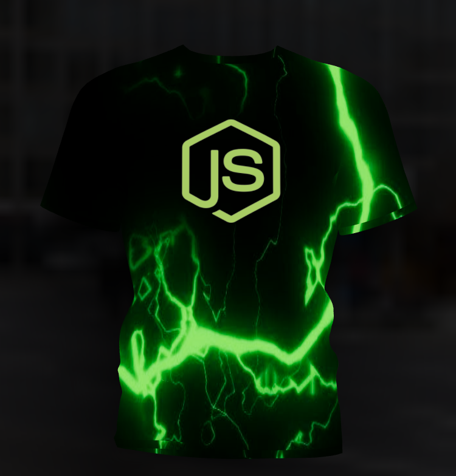

# Customizable T-Shirt Design with three.js

Welcome to the Customizable T-Shirt Design project! This interactive web application allows users to create their own unique t-shirt designs by selecting different colors and uploading logo files. The project is built using the powerful three.js library for 3D rendering.

## Features

- Choose from a variety of t-shirt colors.
- Upload your own logo or design to be displayed on the t-shirt.
- Preview your custom design in a 3D interactive environment.
- Realistic lighting and shading effects powered by three.js.

## Demo

<!--  -->

Check out the live demo of the Customizable T-Shirt Design application: [Demo](https://threejs-t-shirt.vercel.app/).

## Technologies Used

- [React](https://reactjs.org/)
- [Vite](https://vitejs.dev/)
- [@react-three/drei](https://github.com/pmndrs/drei)
- [@react-three/fiber](https://github.com/pmndrs/react-three-fiber)
- [Framer Motion](https://www.framer.com/motion/)
- [maath](https://github.com/gre/gl-matrix)
- [react-color](https://casesandberg.github.io/react-color/)
- [three.js](https://threejs.org/)
- [valtio](https://github.com/pmndrs/valtio)

## Getting Started

To run this project locally:

1. Clone this repository: `git clone https://github.com/your-username/customizable-tshirt.git`
2. Navigate to the project directory: `cd customizable-tshirt`
3. Install dependencies: `npm install`
4. Run development server: `npm run dev`
5. Open your web browser and visit `http://localhost:5173/`.

## Scripts

- `dev`: Start the development server.
- `build`: Build the production-ready bundle.
- `lint`: Run ESLint with specific rules for code quality.
- `preview`: Preview the production build locally.

## Credits

- This project was developed using the three.js library (https://threejs.org/).
- Design by Anderson Mancini, Paul Henschel.

## License

This project is licensed under the [MIT License](LICENSE).

